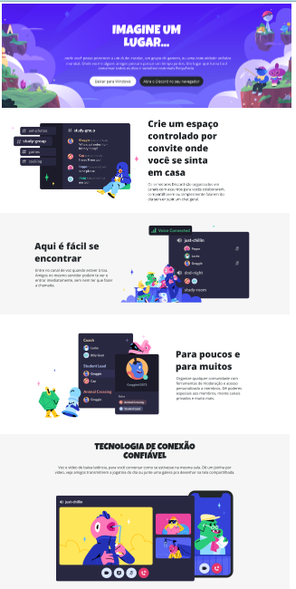

# Módulo 4 - Trilha HTML

O projeto é um <b>clone do site </b><a href="https://discord.com/">Discord</a>, com o intuito de reproduzir a interface, com algumas modificações, aplicando os temas abordados ao longo das aulas de CSS da plataforma da <a href="https://dio.me">Digital Innovation One</a>..-----> <a href='https://clonedodiscord.netlify.app'><button>Confira o projeto clicando aqui</button>

**Título:** Clonando página do Discord, com um layout melhor :)

## Objetivo
Este desafio consiste em treinar estrutura de site, aplicando conhecimentos adiquiridos sobre semântica e acessibilidade.

## Resultado

