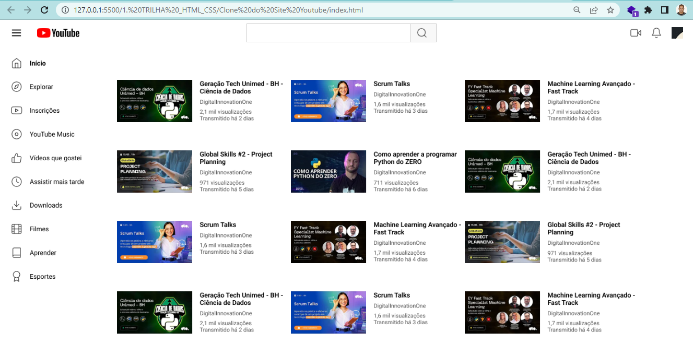

# Módulo 2 - Trilha HTML

**Título:** Clonando página do Youtube, com um layout melhor :)

## Objetivo
Este desafio consiste em treinar estrutura de site, aplicando conhecimentos adiquiridos sobre semântica e acessibilidade.

## Resultado

